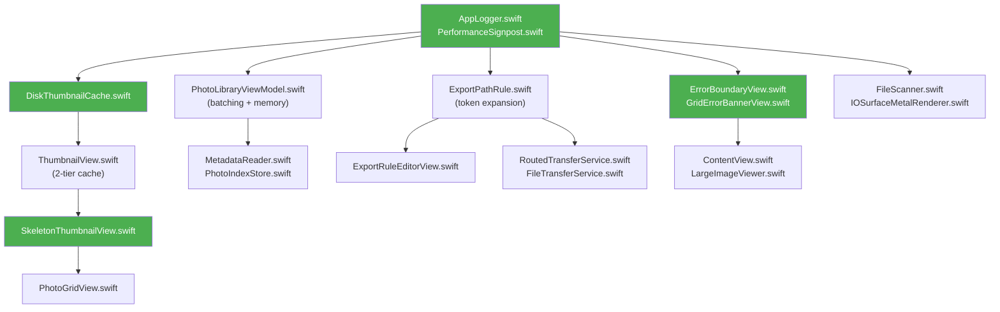

# File-Level Change Specification: Core Health & UI Optimization

## Overview

DuckSort is a native macOS (Swift 6 / SwiftUI) photo culling, tagging, and routing application built as a single-target SwiftUI app (`Package.swift` — `.executableTarget`). The optimization plan targets three critical areas across **~25 source files** in 5 module groups:

| Module Group | Directory | Files Affected | Scope |
|:---|:---|:---|:---|
| **ViewModels** | `DuckSort/ViewModels/` | 1 (2,497 LOC) | Batching, memory, derived state |
| **Views / Components** | `DuckSort/Views/`, `DuckSort/Views/Components/` | 7 | Virtualization, skeletons |
| **Utilities / UI** | `DuckSort/Utilities/UI/` | 3 | LRU + disk cache, scroll observer |
| **Utilities / Metadata** | `DuckSort/Utilities/Metadata/` | 2 | Batch metadata loading |
| **Utilities / Transfers** | `DuckSort/Utilities/Transfers/` | 2 | Dynamic EXIF token expansion |
| **Models** | `DuckSort/Models/` | 2 | Token enum, PhotoSet memory |
| **Infrastructure (NEW)** | `DuckSort/Utilities/` | 3 new files | Logging, error boundaries, disk cache |
| **Tests** | `Tests/DuckSortTests/` | 4 new test files | Unit + benchmark coverage |

---

## 1. New Files To Create

| File Path | Purpose / Module | Primary Dependencies |
|:---|:---|:---|
| `DuckSort/Utilities/Logging/AppLogger.swift` | Centralized structured logging facade wrapping `os.Logger`. Provides subsystem-scoped loggers (`AppLogger.thumbnails`, `.metadata`, `.transfer`, `.ui`) with performance signpost support. | `os`, `Foundation` |
| `DuckSort/Utilities/Logging/PerformanceSignpost.swift` | `OSSignposter`-based interval tracing for critical paths (scan, metadata load, grid render). Enables Instruments profiling integration. | `os`, `Foundation` |
| `DuckSort/Utilities/Cache/DiskThumbnailCache.swift` | Two-tier (memory LRU + disk) thumbnail cache. Disk layer stores decoded `NSImage` as JPEG to `~/Library/Caches/com.ducksort/thumbnails/`. Keyed by `SHA256(url.path + size)`. Configurable max disk budget (default 500 MB). Evicts LRU entries when budget exceeded. | `Foundation`, `CryptoKit`, `AppKit`, `ImageIO` |
| `DuckSort/Views/Components/SkeletonThumbnailView.swift` | Animated shimmer placeholder shown while thumbnails decode. Uses a `LinearGradient` mask with a repeating animation. Matches `ThumbnailView` corner radius and aspect ratio. | `SwiftUI`, `Theme` |
| `DuckSort/Views/Components/ErrorBoundaryView.swift` | Generic SwiftUI error boundary wrapper. Catches thrown errors from child task closures, displays a retry-able inline error card with icon + message + retry button. Logs failures via `AppLogger`. | `SwiftUI`, `AppLogger` |
| `DuckSort/Views/Components/GridErrorBannerView.swift` | Top-anchored dismissable error banner for grid-level failures (scan errors, failed source directories). Replaces the current raw `Alert` in `ContentView`. | `SwiftUI`, `Theme` |
| `Tests/DuckSortTests/ThumbnailCacheTests.swift` | Unit tests for `ThumbnailCache` and `DiskThumbnailCache`: insertion, eviction, LRU ordering, cost accounting, disk budget enforcement. | `XCTest`, `@testable import DuckSort` |
| `Tests/DuckSortTests/MetadataBatchingTests.swift` | Unit tests for `loadBatchMetadataAndTags` concurrency cap, visible-first ordering, and cancellation behavior. | `XCTest`, `@testable import DuckSort` |
| `Tests/DuckSortTests/ExportTokenTests.swift` | Unit tests for dynamic EXIF token expansion: `{year}`, `{camera}`, `{lens}`, `{iso}`, `{aperture}`, `{shutter}`, `{rating}`, `{flag}`, `{primary_tag}`. | `XCTest`, `@testable import DuckSort` |
| `Tests/DuckSortTests/PerformanceBenchmarks.swift` | Performance benchmarks: thumbnail cache hit/miss latency, `updateDerivedState` with 5,000 photo sets, `updateGlobalCounts` timing, memory footprint assertions. | `XCTest`, `@testable import DuckSort` |

---

## 2. Existing Files To Modify

### Phase 1: Batching, Memory Management & LRU + Disk Caching

---

### `DuckSort/ViewModels/PhotoLibraryViewModel.swift`
* **Target Functions/Components:** `loadMetadataAndTags()`, `loadBatchMetadataAndTags()`, `applyMetadataAndTagResults()`, `scanSourceDirectories()`, `updateDerivedState()`, `updateGlobalCounts()`, `preloadNeighbors()`
* **Planned Changes:**
  * **Adaptive batch sizing in `loadMetadataAndTags()`** (L673–L701): Replace the hardcoded `prefix(100)` / `dropFirst(100)` two-phase split with an adaptive batching strategy. Batch size should be configurable (100–250 items), driven by a constant `private static let metadataBatchSize = 150`. Process batches in a loop, applying results after each batch completes, so the UI progressively populates for libraries of 5,000+ photos.
  * **Concurrency cap in `loadBatchMetadataAndTags()`** (L706–L745): The current `maxConcurrency = 16` is appropriate. Add `AppLogger.metadata.debug("Loading batch of \(batch.count) sets, concurrency: \(maxConcurrency)")` instrumentation and an `OSSignposter` interval around the full batch.
  * **Memory pressure awareness**: Add a `DispatchSource.makeMemoryPressureSource()` listener in `init()`. On `.warning` or `.critical` level, call `ThumbnailCache.global.evictAll()` and log via `AppLogger.ui.warning("Memory pressure — evicted thumbnail cache")`.
  * **`preloadNeighbors()` guard** (L1406–L1427): Add `guard !isScrolling` check from `ScrollStateObserver.shared.isScrolling` to skip preloading during active scroll, preventing decode work from competing with visible cell rendering.
  * **`updateDerivedState()` skip-if-equal** (L1907): After computing the new `filteredPhotoSets` array, compare element-wise with the existing array and skip the `@Published` assignment if unchanged to avoid unnecessary SwiftUI diffing.
  * **Add structured logging** throughout scan, metadata, and transfer paths using `AppLogger` subsystem loggers.
* **Validation Check:** `swift test --filter MetadataBatchingTests && swift test --filter PerformanceBenchmarks`

---

### `DuckSort/Views/Components/ThumbnailView.swift`
* **Target Functions/Components:** `ThumbnailView`, `ThumbnailLoader`, `ThumbnailService`, `ThumbnailCache`, `AsyncSemaphore`
* **Planned Changes:**
  * **Skeleton placeholder** (L33–L61): Replace the static gradient placeholder with the new `SkeletonThumbnailView()` shimmer component when `loader.image == nil` and the `.task` is in flight. Add a `@State private var isLoading = true` flag to track decode state.
  * **Disk cache integration** (L66, L124, L155, L164, L182, L188): Modify `ThumbnailCache` to become a two-tier cache. On memory miss, check `DiskThumbnailCache.shared` before dispatching to `ThumbnailService` for decode. On decode success, write to both memory and disk caches.
  * **Concurrency limit** (L117): Change `AsyncSemaphore(limit: 6)` to `AsyncSemaphore(limit: ProcessInfo.processInfo.activeProcessorCount.clamped(to: 4...8))` — dynamically sized to core count, bounded 4–8 to prevent thrashing on high-core machines.
  * **`ThumbnailCache` memory-tier improvements** (L282–L316):
    - Add `evictAll()` method for memory pressure handler.
    - Add `func remove(for url: URL, size: CGSize)` for targeted invalidation.
    - Track access recency to implement true LRU ordering (the current `NSCache` already approximates LRU but doesn't guarantee it).
  * **Cancellation improvement** (L62–L94): The existing `.task(id: url)` cancellation is correct. Add `AppLogger.thumbnails.trace("Cache hit for \(url.lastPathComponent)")` and `AppLogger.thumbnails.trace("Decode started for \(url.lastPathComponent)")` for debugging.
* **Validation Check:** `swift test --filter ThumbnailCacheTests`

---

### `DuckSort/Utilities/UI/ScrollStateObserver.swift`
* **Target Functions/Components:** `ScrollStateObserver`
* **Planned Changes:**
  * **Expose scroll velocity** (new computed property): Add `@Published private(set) var scrollVelocity: CGFloat = 0` tracked from `NSScrollView.didLiveScrollNotification`. This allows `ThumbnailView` to select LOD tier based on scroll speed (fast scroll → 64px proxy, slow scroll → 128px, stopped → full resolution).
  * **Debounce tuning**: Reduce settle timeout from `0.075s` to `0.05s` (L30, L40) for snappier full-res upgrades after scroll stops.
* **Validation Check:** Manual scroll test — verify full-res thumbnails appear within 50ms of scroll settle.

---

### `DuckSort/Utilities/Metadata/MetadataReader.swift`
* **Target Functions/Components:** `metadata(for:)`, `parseXMPText()`
* **Planned Changes:**
  * **Add logging**: Instrument `metadata(for:)` (L56) with `AppLogger.metadata.debug("Reading metadata for \(url.lastPathComponent)")`. Log fallback path activations at `.info` level.
  * **Error resilience**: Wrap the `CGImageSourceCreateWithURL` path (L64) in an `autoreleasepool` to bound transient ObjC object lifetimes during batch loads. Currently relies on ARC timing which can spike memory during rapid serial loads.
* **Validation Check:** Profile with Instruments → Allocations during a 3,000-photo scan.

---

### `DuckSort/Utilities/Metadata/PhotoIndexStore.swift`
* **Target Functions/Components:** `index()`, `findSimilarPhotos()`
* **Planned Changes:**
  * **Batch index API**: Add `func indexBatch(_ photoSets: [PhotoSet])` that acquires the lock once and indexes all sets in a single critical section, replacing the current per-item `index()` which acquires/releases the lock per photo.
  * **Add logging**: `AppLogger.metadata.info("Indexed \(photoSets.count) photo sets")`.
* **Validation Check:** `swift test --filter PerformanceBenchmarks`

---

### `DuckSort/Utilities/UI/Theme.swift`
* **Target Functions/Components:** `Theme.Color`, `Theme.Font`
* **Planned Changes:**
  * **Dynamic Type scaling**: Add `Theme.Font.scaledBody`, `Theme.Font.scaledCaption` that use `@ScaledMetric` wrappers to respect the user's preferred text size.
  * **Skeleton shimmer token**: Add `Theme.Color.skeletonBase` and `Theme.Color.skeletonHighlight` for the shimmer placeholder gradient.
* **Validation Check:** Verify build compiles.

---

### `DuckSort/Models/PhotoSet.swift`
* **Target Functions/Components:** `PhotoSet` struct
* **Planned Changes:**
  * **Memory optimization**: The `fileBreakdown: [FileBreakdownEntry]` array (L56) is only used in the large image viewer sidebar. Make it `lazy var` or move it to a computed property with caching at the view layer to reduce per-PhotoSet memory footprint for the 90% case (grid view).
  * **Equatable cost**: The current `==` (L159–L164) compares 4 fields which is fast. No change needed, but document the performance contract.
* **Validation Check:** Memory profiling — verify PhotoSet array for 5,000 items stays under 50 MB.

---

### Phase 2: Virtualization, Dynamic Tokens, Skeleton States

---

### `DuckSort/Views/PhotoGridView.swift`
* **Target Functions/Components:** `PhotoGridView`, `body`, `cell(for:photoSet:)`
* **Planned Changes:**
  * **Virtualization verification**: The grid already uses `LazyVGrid` (L84) which provides native SwiftUI virtualization. Verify with Instruments that off-screen cells are fully deallocated. If not, add `.onDisappear` handlers to nil out the `ThumbnailLoader.image` on cells that scroll out of the viewport.
  * **Skeleton state integration**: When `viewModel.isScanning` is true and `filteredPhotoSets` is empty, show a grid of `SkeletonThumbnailView` placeholders matching the column layout.
* **Validation Check:** Profile with Instruments → SwiftUI → View Body invocations during rapid scrolling. Target: < 16ms per frame (60 FPS).

---

### `DuckSort/Views/Components/PhotoSetCell.swift`
* **Target Functions/Components:** `PhotoSetCell`, `thumbnail`, `body`
* **Planned Changes:**
  * **Focus ring styling**: Ensure `focusBorderColor` (L40–L42) is clean against `Theme.Color.cellBackground`.
* **Validation Check:** Verify visual focus ring is clear.

---

### `DuckSort/Views/ContentView.swift`
* **Target Functions/Components:** Top-level `ContentView`, error alert binding
* **Planned Changes:**
  * **Error boundary integration**: Wrap the main `NavigationSplitView` body in `ErrorBoundaryView` to catch unhandled async errors from child views. Replace the raw `.alert(isPresented:)` error modal (L46–L49, L248–L249) with the new `GridErrorBannerView` for non-fatal errors and keep the modal only for critical/blocking errors.
* **Validation Check:** Trigger an error (disconnect source folder during scan) → verify banner appears, is dismissable, and logs via `AppLogger`.

---

### `DuckSort/Views/SidebarView.swift`
* **Target Functions/Components:** `SidebarView`, `LiquidGlassRowBackground`, tag/category rows
* **Planned Changes:**
  * **Sidebar selection contrast**: Adjust selection fill color for high visibility.
* **Validation Check:** Verify selection fill in sidebar is clear.

---

### `DuckSort/Views/HeaderFilterBar.swift`
* **Target Functions/Components:** Filter bar buttons and popovers
* **Planned Changes:**
  * **Pill styling**: Verify filter pill text colors are distinct against their backgrounds in both light and dark mode.
* **Validation Check:** Verify contrast visually.

---

### `DuckSort/Models/ExportPathRule.swift`
* **Target Functions/Components:** `ExportPathComponent`, `ExportPathRouter.destinationFolders()`
* **Planned Changes:**
  * **Dynamic EXIF token expansion**: Add new `ExportPathComponent` cases to support rich metadata-driven folder routing:
    ```swift
    case year                  // {year} → "2026"
    case month                 // {month} → "07"
    case day                   // {day} → "29"
    case camera                // {camera} → "Fujifilm X-T5"
    case lens                  // {lens} → "XF 56mm f/1.2"
    case iso                   // {iso} → "ISO 800"
    case aperture              // {aperture} → "f1.2"
    case shutterSpeed          // {shutter} → "1-250s"
    case ratingStars           // {rating}_stars → "4_stars"
    case flagStatus            // {flag} → "Flagged" | "Rejected" | "Unflagged"
    case primaryTag            // {primary_tag} → first assigned tag name
    ```
  * Update `ExportPathRouter.destinationFolders()` switch statement to handle every new case, reading values from `MetadataSnapshot` and the assigned tags array.
  * Update `ExportPathRouter.describe()` to render human-readable previews of the new tokens.
  * Add `id`, `displayName`, and `systemImage` properties for each new case.
* **Validation Check:** `swift test --filter ExportTokenTests`

---

### `DuckSort/Views/ExportRuleEditorView.swift`
* **Target Functions/Components:** Rule component picker, rule preview
* **Planned Changes:**
  * **New token picker entries**: Add all new `ExportPathComponent` cases to the component picker UI. Group them into sections: "Date Tokens", "Equipment Tokens", "Exposure Tokens", "Workflow Tokens".
  * **Live preview**: Update the rule preview string to show example values for EXIF tokens (e.g., `2026 / Fujifilm X-T5 / f1.2 / 4_stars`).
* **Validation Check:** Manual — open Export Rule Editor → verify all new tokens appear and preview renders correctly.

---

### `DuckSort/Utilities/Transfers/FileNaming.swift`
* **Target Functions/Components:** `FileNaming`, `CollisionResolver`
* **Planned Changes:**
  * **Logging**: Add `AppLogger.transfer.debug()` calls in `CollisionResolver.resolve()` to log skip/overwrite/rename decisions.
* **Validation Check:** Run a test transfer with collisions → verify log output.

---

### `DuckSort/Utilities/Transfers/FileTransferService.swift`
* **Target Functions/Components:** `FileTransferService.execute()`
* **Planned Changes:**
  * **Structured logging**: Replace any `print()` statements with `AppLogger.transfer` calls. Add signpost intervals around the full transfer operation.
  * **Error boundary**: Wrap individual file copy/move operations in error-catching blocks that log failures without aborting the entire transfer.
* **Validation Check:** Run a transfer with one intentionally unreadable file → verify it logs the error and continues.

---

### `DuckSort/Utilities/Transfers/RoutedTransferService.swift`
* **Target Functions/Components:** `RoutedTransferService.execute()`
* **Planned Changes:**
  * **Token-aware routing**: The router already calls `ExportPathRouter.destinationFolders()` (L64). No changes needed here — the new tokens are handled upstream in `ExportPathRule.swift`.
  * **Structured logging**: Add `AppLogger.transfer.info("Routing \(plan.photos.count) photos via rule '\(plan.ruleName)'")`.
* **Validation Check:** Run a routed transfer → verify folder structure matches expected token expansion.

---

### Phase 3: Error Boundaries & Structured Logging

---

### `DuckSort/DuckSortApp.swift`
* **Target Functions/Components:** `DuckSortApp`, `AppDelegate`
* **Planned Changes:**
  * **Global error handler**: Add `NSSetUncaughtExceptionHandler` and `signal()` handlers in `AppDelegate.applicationDidFinishLaunching` that log to `AppLogger.ui.critical()` before crash.
  * **Memory pressure registration**: Register for `ProcessInfo.processInfo.performExpiringActivity()` or `DispatchSource.makeMemoryPressureSource()` at the app level and forward events to the ViewModel.
* **Validation Check:** Force a memory warning in Instruments → verify log output and cache eviction.

---

### `DuckSort/Utilities/UI/IOSurfaceMetalRenderer.swift`
* **Target Functions/Components:** `IOSurfaceMetalRenderer`, `computeHistogram(from:)`, `makeTexture(from:)`
* **Planned Changes:**
  * **Error logging**: Add `AppLogger.ui.error("Failed to create Metal device")` and similar at each fallible initialization point (L31–L37). Currently fails silently.
  * **Histogram logging**: Add `AppLogger.ui.debug("Histogram computed: highlight clip \(result.highlightClippingPercent)%")`.
* **Validation Check:** Run on a machine without a discrete GPU → verify graceful degradation logging.

---

### `DuckSort/Utilities/Scanner/FileScanner.swift`
* **Target Functions/Components:** `FileScanner.scanDirectory()`, `FileScanner.scanDirectories()`
* **Planned Changes:**
  * **Structured logging**: Add `AppLogger.metadata.info("Scanning directory: \(url.lastPathComponent)")` at scan start and `AppLogger.metadata.info("Scan complete: \(result.photoSets.count) sets, \(result.scannedFileCount) files")` at completion.
  * **Error boundary**: Individual unreadable files currently cause `continue` (skip). Add `AppLogger.metadata.warning("Skipped unreadable file: \(url.lastPathComponent)")` for each.
* **Validation Check:** Scan a directory with permission-denied files → verify warning logs.

---

### `DuckSort/Utilities/AI/VisionEngineActor.swift`
* **Target Functions/Components:** `VisionEngineActor`, `generateFeaturePrint(at:)`
* **Planned Changes:**
  * **Logging**: Add `AppLogger.metadata.debug("Generating feature print for \(url.lastPathComponent)")` and error-case logging.
* **Validation Check:** Run auto-tag on a set → verify log output.

---

### `DuckSort/Views/LargeImageViewer.swift`
* **Target Functions/Components:** Large image viewer panel
* **Planned Changes:**
  * **Error boundary**: Wrap image loading in `ErrorBoundaryView` so a corrupt file doesn't crash the viewer — shows a retry-able error card instead.
* **Validation Check:** Open a corrupt file in the viewer → verify error card appears.

---

### `DuckSort/Views/Layout/LargeImagePane.swift`
* **Target Functions/Components:** Image pane rendering
* **Planned Changes:**
* **Validation Check:** Verify zoom behavior.

---

### `Package.swift`
* **Target Functions/Components:** Package manifest
* **Planned Changes:**
  * No new external dependencies required. All features use Apple frameworks (`os`, `Foundation`, `CryptoKit`, `Accelerate`, `Metal`, `ImageIO`). The test target already exists (L21–L25). No changes needed unless benchmarking requires XCTest performance testing APIs (already included in the platform SDK).
* **Validation Check:** `swift build && swift test`

---

## 3. Recommended Dependencies / Packages

| Package | Justification | Version Constraint | Decision |
|:---|:---|:---|:---|
| *None* | All optimizations use Apple-native frameworks (`os.Logger`, `NSCache`, `CryptoKit`, `Accelerate`, `ImageIO`, `QuickLookThumbnailing`). No third-party dependencies are required. | N/A | **No new packages** |

> [!NOTE]
> DuckSort intentionally maintains a zero-dependency posture. The `NSCache` + `FileManager` + `CryptoKit` stack provides everything needed for the two-tier LRU + disk cache. `os.Logger` and `OSSignposter` provide Apple-recommended structured logging with zero overhead when disabled. SwiftUI's native `LazyVGrid` provides virtualization.

---

## 4. Test Suite Strategy & File Locations

### Unit Test Files to Add/Update

| Test File | Module Covered | Key Assertions |
|:---|:---|:---|
| `Tests/DuckSortTests/ThumbnailCacheTests.swift` | `ThumbnailCache`, `DiskThumbnailCache` | Cache hit/miss, LRU eviction order, cost accounting, disk budget enforcement, `evictAll()` |
| `Tests/DuckSortTests/MetadataBatchingTests.swift` | `PhotoLibraryViewModel.loadBatchMetadataAndTags` | Batch size respects constant, visible-first ordering, cancellation mid-batch, concurrent cap ≤ 16 |
| `Tests/DuckSortTests/ExportTokenTests.swift` | `ExportPathComponent`, `ExportPathRouter` | Every EXIF token resolves correctly from a `MetadataSnapshot`, fallback values for nil fields, path sanitization |
| `Tests/DuckSortTests/PerformanceBenchmarks.swift` | Cross-cutting | Memory and timing benchmarks |

### Existing Tests to Update

| Test File | Changes |
|:---|:---|
| `Tests/DuckSortTests/SmokeTests.swift` | No changes — existing smoke test remains. |
| `Tests/DuckSortTests/FileScannerTests.swift` | Add assertion for structured log output (verify `AppLogger.metadata` emits expected messages). |

### Benchmarks

| Benchmark | Target | Script/Command |
|:---|:---|:---|
| **Memory footprint (grid with 5,000 photos)** | < 350 MB RSS | `Tests/DuckSortTests/PerformanceBenchmarks.swift` → `testMemoryFootprint5000Photos()` using `mach_task_basic_info` |
| **Grid render FPS during scroll** | 60 FPS (< 16.67ms per frame) | Instruments → SwiftUI → View Body tracing during 5s continuous scroll |
| **`updateDerivedState` latency (5,000 sets)** | < 10ms | `PerformanceBenchmarks.swift` → `testUpdateDerivedStatePerformance()` via `measure {}` |
| **Thumbnail cache hit latency** | < 1ms | `PerformanceBenchmarks.swift` → `testCacheHitLatency()` |
| **Metadata batch load (1,000 photos)** | < 3s | `PerformanceBenchmarks.swift` → `testMetadataBatchLoad1000()` |
| **Disk cache read latency** | < 5ms | `PerformanceBenchmarks.swift` → `testDiskCacheReadLatency()` |

### Validation Commands

```bash
# Full test suite
swift test

# Specific test filters
swift test --filter ThumbnailCacheTests
swift test --filter MetadataBatchingTests
swift test --filter ExportTokenTests
swift test --filter PerformanceBenchmarks

# Build verification
swift build -c release

# Profile (manual)
# Open Instruments → Allocations → Run DuckSort → Load 3,000-photo folder
# Open Instruments → SwiftUI → Verify body invocation count during scroll
```

---

## Appendix: File Inventory Summary

### Files by Phase

| Phase | New Files | Modified Files | Total |
|:---|:---|:---|:---|
| **Phase 1** — Batching, Memory, LRU + Disk Cache | 2 | 6 | 8 |
| **Phase 2** — Virtualization, Tokens, Skeletons | 3 | 7 | 10 |
| **Phase 3** — Error Boundaries, Logging | 5 | 5 | 10 |
| **Tests** | 4 | 1 | 5 |
| **Total** | **10** | **15** | **25** |

### Dependency Graph (Build Order)



> **Legend**: Green nodes = new files. White nodes = modified files. Arrows = build dependency direction.
