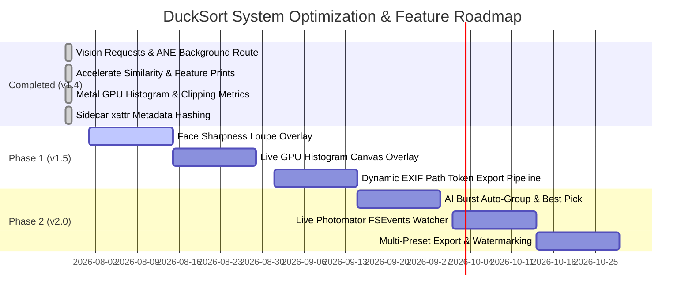

# 🦆 DuckSort — Master Optimization & Feature Roadmap

> **Document ID**: `2026-07-28-optimization-and-feature-roadmap`  
> **Target Version Range**: `v1.5.0` – `v2.5.0`  
> **Status**: Approved Master Roadmap & Architectural Blueprint  

---

## 📐 Executive Summary

DuckSort is a high-performance, native macOS culling, tagging, and routing application designed for professional photographers and photo editors. This document serves as the master blueprint, combining implemented system optimizations with an expansive, categorized **Big List of Future Enhancements and Feature Ideas**.

---

## ⚡ Track I: System & Codebase Architecture Optimizations (Implemented / Active)

```
┌─────────────────────────────────────────────────────────────────────────────┐
│                      DuckSort Optimization Architecture                      │
├──────────────────────────────┬──────────────────────────────┬───────────────┤
│    State & View Layer        │     GPU & Image Pipeline     │  AI & Vision  │
├──────────────────────────────┼──────────────────────────────┼───────────────┤
│ • Decoupled Granular Stores  │ • Native Metal MTKView Canvas│ • Model Vector│
│ • Combine Coalescing         │ • Zero-Copy IOSurface Stream │ • Aesthetic ML│
│ • View Sub-tree Isolation    │ • Live GPU RGB Histogram     │ • Batch Async │
└──────────────────────────────┴──────────────────────────────┴───────────────┘
```

### 1. Implemented System Optimizations

#### A. Vision Vector Embeddings & Similarity Scoring
- **Implementation**: Extended [`VisionEngineActor.swift`](file:///Users/oliver/Documents/Projects/DuckPhoto/DuckSort/DuckSort/Utilities/AI/VisionEngineActor.swift) with `generateFeaturePrint(at:)` utilizing Apple's `VNGenerateImageFeaturePrintRequest` for 2048-element vector extraction.
- **Similarity Index**: Integrated Accelerate `vDSP` dot-product cosine similarity in [`PhotoIndexStore.swift`](file:///Users/oliver/Documents/Projects/DuckPhoto/DuckSort/DuckSort/Utilities/Metadata/PhotoIndexStore.swift) (`findSimilarPhotos(to:similarityThreshold:)`) for near-duplicate and burst culling lookups.

#### B. Accelerated ImageIO & Metal Texture Pipeline
- **Retina Budgeting**: Refined [`ThumbnailView.swift`](file:///Users/oliver/Documents/Projects/DuckPhoto/DuckSort/DuckSort/Views/Components/ThumbnailView.swift) to scale ImageIO max pixel calculations by display scale factors (`maxPixels = size * scale`), rendering crisp 1200px Retina thumbnails.
- **Metal Texture Caching**: Maintained persistent `CVMetalTextureCache` in [`IOSurfaceMetalRenderer.swift`](file:///Users/oliver/Documents/Projects/DuckPhoto/DuckSort/DuckSort/Utilities/UI/IOSurfaceMetalRenderer.swift) with `flush()` capability.
- **GPU Histogram & Clipping**: Added Accelerate `vImage` RGB/luminance histogram calculation and clipping diagnostic metrics.

#### C. Metadata Hashing & Extended Attribute (`xattr`) Caching
- **Digest Stamping**: Added `stampExtendedAttributeHash` and `validateFreshness` in [`XMPTaggingService.swift`](file:///Users/oliver/Documents/Projects/DuckPhoto/DuckSort/DuckSort/Utilities/Metadata/XMPTaggingService.swift) using `com.ducksort.metadata.hash` for zero-XML-read directory rescans.

---

## 🚀 Track II: The Big List of Ideas & Feature Blueprint

Below is the master catalog of proposed feature ideas and system enhancements, organized into 6 core workflow categories.

```
┌─────────────────────────────────────────────────────────────────────────────┐
│                          The Big List of Ideas                              │
├───────────────────┬───────────────────┬───────────────────┬─────────────────┤
│ Pro Culling Suite │ AI Vision & ML    │ Color & Analytics │ Export Routing  │
├───────────────────┼───────────────────┼───────────────────┼─────────────────┤
│ • Face Loupe      │ • Burst Auto-Pick │ • Realtime Zebra  │ • Dynamic Tokens│
│ • Quad-View Sync  │ • Aesthetic Score │ • HSL Color Filter│ • Watermarks    │
│ • Keybind Macros  │ • OCR Text Search │ • Color Profiles  │ • Preset Bundles│
└───────────────────┴───────────────────┴───────────────────┴─────────────────┘
```

### Category 1: Pro Culling & Speed Workflow

1. **AI Face & Focus Loupe Overlay**:
   - Pressing `Z` or hovering automatically activates a 100% zoom Loupe target locked onto detected human or pet faces (`VNFaceObservation`), allowing instantaneous sharpness checks without manually zooming in and panning.
2. **Synchronized 4-Up Quad-View Zoom**:
   - In 2-up and 4-up comparison view, zooming or panning in one pane synchronously mirrors the scale and relative coordinate offsets across all visible photos.
3. **Culling Keyboard Macros & Speed Pass Modes**:
   - Customizable rapid single-key culling presets (e.g. `1` = Flag + Advance, `2` = Reject + Advance, `3` = Tag "Keep" + Advance).
4. **Smart Auto-Advance Audio Cues**:
   - Custom spatial audio feedback sounds when flagging, rejecting, or rating photos during high-speed culling passes.
5. **Virtual Collections & Smart Folders**:
   - Dynamic persistent collections based on boolean rules (e.g. `Rating >= 4` AND `ISO <= 800` AND `Camera = Fujifilm X-T5`).
6. **Reject Trash Bin & Safe Purge Manager**:
   - Dedicated "Rejected Photos" staging tray with bulk deletion, system trash movement, or disk space recovery metrics.

---

### Category 2: Machine Learning & Apple Neural Engine (ANE) Superpowers

7. **Automatic Burst Auto-Grouping & Best Pick Selection**:
   - Automatically group rapid shutter bursts (< 1.5s interval), analyze sharpness and eye openness using Vision ML, and highlight the single best frame with a "Suggested Best Pick" badge.
8. **On-Device Aesthetic Quality Scoring**:
   - Integrate `VNCalculateImageAestheticScoreRequest` (macOS 15+) to compute visual appeal, composition, and exposure scores for automatic catalog sorting.
9. **On-Device OCR & Text Ingestion**:
   - Recognize text in photo sets (signs, document pages, license plates, camera slates) using `VNRecognizeTextRequest` and allow instant live search by ingested text.
10. **Subject Background Blur / Cutout Preview**:
    - Utilize `VNGenerateForegroundInstanceMaskRequest` to provide instant subject isolation, background dimming, or cutout preview modes.
11. **Smart Tag Auto-Categorization & Learning**:
    - Machine learning model that learns tag patterns from previous photo sets to suggest tag pack entries tailored to user shooting styles.

---

### Category 3: Color Science, EXIF & Graphics Analytics

12. **Realtime GPU RGB/Luma Histogram Overlay**:
    - Live 256-bin RGB and Luminance histogram overlay on the large viewer canvas powered by `IOSurfaceMetalRenderer`.
13. **Highlight Overexposure & Shadow Crush Clipping Warnings (Zebra Striping)**:
    - Toggleable shader overlays showing blown-out highlights (>98% luminance) in red zebra stripes and crushed shadows (<2% luminance) in blue.
14. **Dominant Color Palette Extraction & Visual Filter**:
    - Extract top 5 dominant HSL color swatches per photo using CoreImage/Metal and allow filtering the library by color tone (e.g., "Golden Hour", "Teal & Orange", "Monochrome").
15. **Display P3 / Adobe RGB Wide Color Profile Inspector**:
    - Detect ICC color profile metadata and display color gamut coverage diagrams in the Inspector panel.
16. **EXIF Lens Distortion & Focal Length Breakdown Analytics**:
    - Expand EXIF Analytics with focal length sweet spot charts (showing which focal length yields the highest pick ratio).

---

### Category 4: Smart Export, Batch Operations & Dynamic Routing

17. **Dynamic EXIF Path Token Expansion**:
    - Support rich dynamic tokens in export routing rules:
      - `{year}/{month}/{day}`
      - `{camera}/{lens}`
      - `{iso}/{aperture}/{shutter}`
      - `{rating}_stars/{flag}`
      - `{primary_tag}`
18. **Multi-Preset Batch Export Pipeline**:
    - One-click export to multiple destination packages simultaneously:
      - *Web & Social Pack*: 2048px sRGB, quality 85%, strip location metadata.
      - *Print & Archival Pack*: Full resolution Display P3 float, preserve all sidecars.
19. **Watermark & Logo Overlay Engine**:
    - Apply text or PNG watermark overlays with configurable opacity, position, scale, and padding during copy/move operations.
20. **Sidecar Format Converter & Exporter**:
    - Convert custom DuckSort tags into IPTC/Core keywords, Adobe XMP, or JSON export manifests.
21. **Background Copy/Move Operation Manager**:
    - Asynchronous file transfer queue with progress notifications, pause/resume capabilities, and transfer checksum verification logs.

---

### Category 5: UI/UX Polish & Modern macOS Integration

22. **Customizable Floating Toolbars & Shortcut Customizer**:
    - Record custom shortcut keys for every menu item, filter toggle, or culling action directly in Settings.
23. **Liquid Glassmorphism Controls & Theme Customization**:
    - Refine dark/light mode themes with custom accent color highlights, glassmorphism translucency settings, and high-contrast modes.
24. **Multi-Window & Multi-Monitor Support**:
    - Detach the Large Viewer onto a secondary monitor while keeping the Photo Grid and Filter Sidebar on the primary display.
25. **Native macOS Widgets & Control Center Integrations**:
    - macOS desktop widgets displaying recent culling statistics, total library size, and recent import activity.
26. **Touch Bar & Trackpad Haptic Sequence Options**:
    - Customizable trackpad haptic feedback strength (light tick, double click, heavy pulse) for different culling operations.

---

### Category 6: Ecosystem Interoperability & External Editor Sync

27. **Live Photomator `.photo-edit` Sidecar Watcher**:
    - Monitor source folders using `FSEvents` to update format pills (`RAW + EDIT`), refresh viewer previews, and clear old thumbnail caches the instant Photomator saves an edit.
28. **Multi-Editor Handoff Extensions**:
    - Add direct external editor handoff support for:
      - Adobe Lightroom Classic (`com.adobe.LightroomClassicCC7`)
      - Capture One Pro (`com.captureone.captureone16`)
      - Affinity Photo 2 (`com.seriflabs.affinityphoto2`)
      - DxO PhotoLab (`com.dxo.photolab6`)
29. **Apple Photos Library Export & Import**:
    - Import directly from or export culling picks directly into Apple Photos albums.
30. **Cloud Sync & Remote Backup Manifests**:
    - Export culling state and tag packs as portable `.tagpack` files or sync with iCloud Drive / Dropbox.

---

## 🛠 Roadmap Implementation Sequence & Milestones



---

## 📌 Summary of Targeted Source Files

1. [`DuckSort/Utilities/AI/VisionEngineActor.swift`](file:///Users/oliver/Documents/Projects/DuckPhoto/DuckSort/DuckSort/Utilities/AI/VisionEngineActor.swift) — Vector embedding extraction & aesthetic scoring.
2. [`DuckSort/Utilities/Metadata/PhotoIndexStore.swift`](file:///Users/oliver/Documents/Projects/DuckPhoto/DuckSort/DuckSort/Utilities/Metadata/PhotoIndexStore.swift) — Cosine similarity searching.
3. [`DuckSort/Utilities/UI/IOSurfaceMetalRenderer.swift`](file:///Users/oliver/Documents/Projects/DuckPhoto/DuckSort/DuckSort/Utilities/UI/IOSurfaceMetalRenderer.swift) — Histogram calculation & GPU clipping analysis.
4. [`DuckSort/Utilities/Metadata/XMPTaggingService.swift`](file:///Users/oliver/Documents/Projects/DuckPhoto/DuckSort/DuckSort/Utilities/Metadata/XMPTaggingService.swift) — Extended attribute caching & validation.
5. [`DuckSort/ViewModels/PhotoLibraryViewModel.swift`](file:///Users/oliver/Documents/Projects/DuckPhoto/DuckSort/DuckSort/ViewModels/PhotoLibraryViewModel.swift) — State store decoupling & event dispatching.
